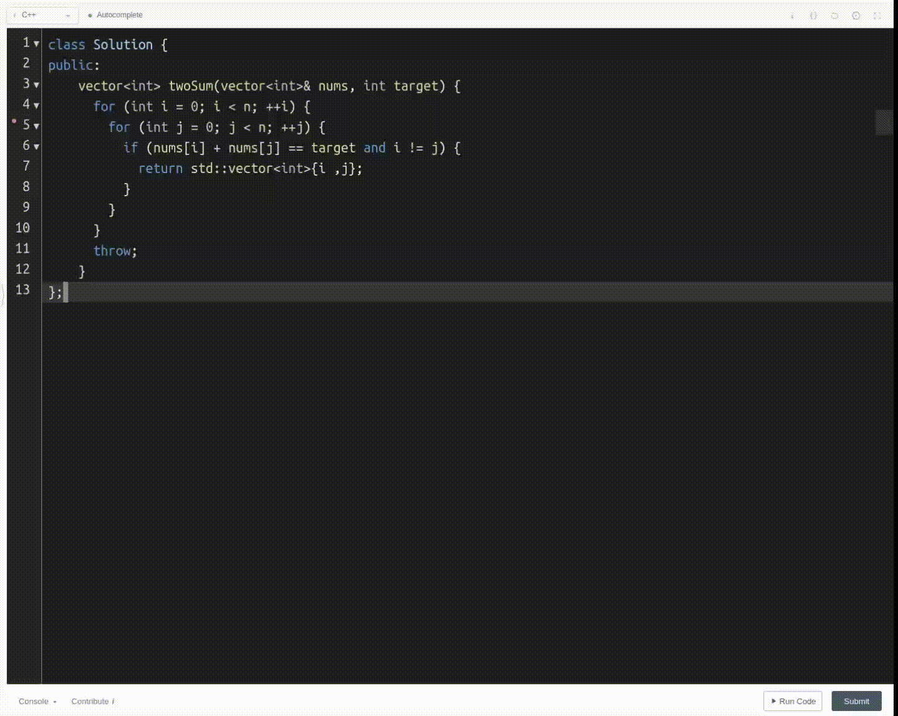

# LeetCode Mate

> A Chrome extension to improve your LeetCode Experience!

### Usage
* Use `Ctrl + Enter` to submission and display submission result
* Use `Alt + Enter` to enter test cases and run test cases

### Demo
#### Accepted

#### Error

### TODO 
* Theming Options

